2025.11.03-04.4 湖北十堰武当山38公里爬山

2025.11.02日从随州火车到达十堰住宿一晚，第二天早乘坐公交去心心念念许久的武当山。

# 爬山行程
- 37.98公里，耗时15小时53分，累积爬升2253米.
- 2025.11.03日，公交车直达售票点前,结果一查野徒线路，发现坐过了几站，只好手机导航从售票中心走路6公里去野徒入口。
野徒入口为不对外开放的五龙宫景区入口旁边一条废弃的混凝土马路，沿其爬升。大概2公里左右后进入离开马路，进入减震极好的泥土路。
沿野路一路前行，第一个景观就是仁威观遗址，只剩下两道残缺的观门，但从观址地基依稀可想像当年庞大的道观模样，印象深刻，此观有两工作人员值守。
沿徒步线路前行，途经 虎山垭子，隐仙岩，五龙村。到达五龙村时，天已经黑透，戴上头灯继续前行，后来进入一片叮呤水声的沿溪石道，一路前行。
到了晚上9点左右，路过一个施工未完成的公共厕所，担心头灯电量不足，决定就是露宿。没有没带帐篷和睡袋，只好下面垫上随身带的垃圾袋，合衣躺在施工脚手架上入睡。
山林夜晚雾气氤氤，虫鸣水溅之声不绝于耳。
到了凌晨4点左右，冻得睡不着了，估摸着天快亮了，然后走向戴头灯继续赶路。
5点天亮，沿溪景色极其优美，可惜黑暗中错过了太多的美景。
- 2025.11.04日，一路经过南岩宫 猴面岩，榔梅祠，才到达第一个遇到的景区客栈，终于吃上了爬山以来的第一口热饭，赶紧给手机，充电宝充电。
吃了老板娘推荐的炒腊肉，极其肥腻，吃后让我上火了几天，随后几天感觉血脂飙升，相当难受。
此后就是纯景区台阶路爬升了，经四座塔，黄龙洞，朝天宫，一天门，会仙桥，二天门到达金顶下建筑群。上金顶需要检验门票，我是走驴友野线上山的，没经过售票处没购票，故而放弃上金顶，一路徒步下山到达琼台（山下）。
琼台距离售票出口25公里，同样由于门票原因，无法乘坐景区观光车。由于觉得体力还好，而且沿途风景不错，决定徒步25公里去售票出口处。
徒步8公里后，遇到景区内一农田里干活的大姐收工，在大姐指点下，坐上了景区居民的免费公交车到达售票出口。

# 消费
武当山消费正常，就是门票255块钱比较贵。

# 体验
- 十堰特价极其便宜，水果极其鲜美(不知道是不是十堰特殊的地理气候原因)，在十堰可以实现鲜美水果自由。
- 武当山野徒驴友线路极其友好，景色优美。对于体力尚好的驴友，建议走野线，而非枯燥的景区线程，更能体验到武当山的山灵水秀。
- 驴友线路前25公里左右无补给，需要自备充足的水和食物。

___
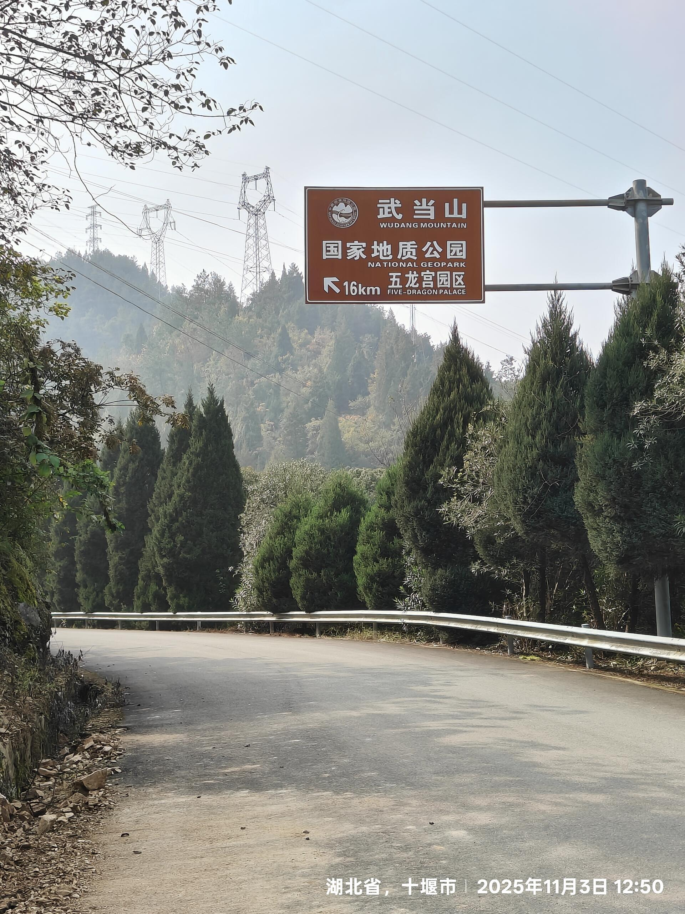 
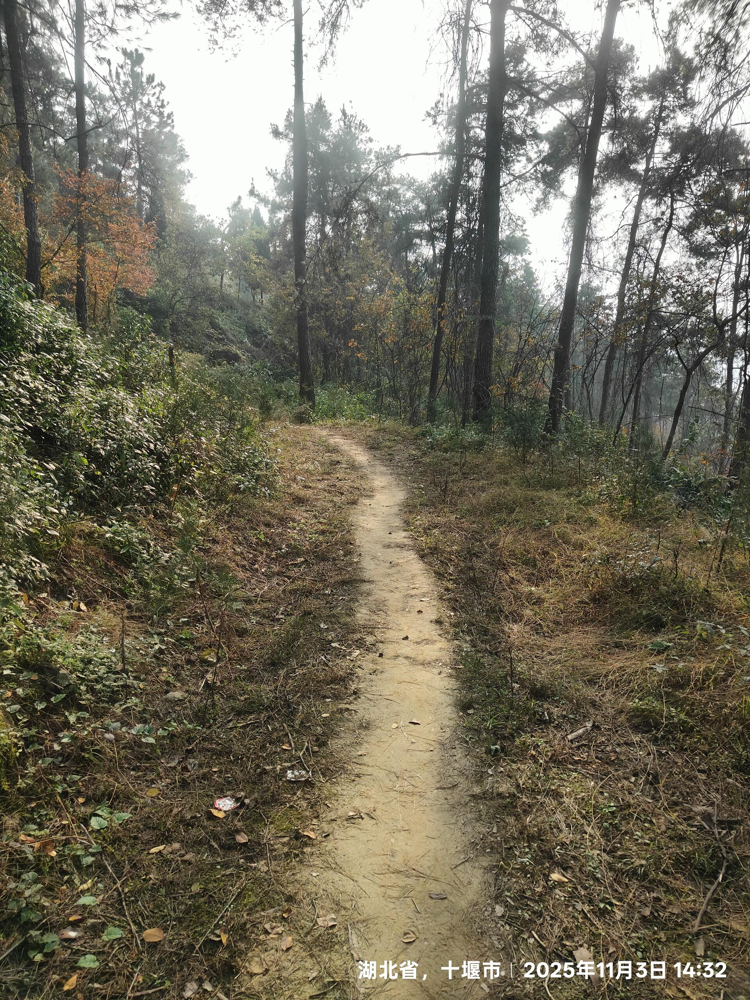 
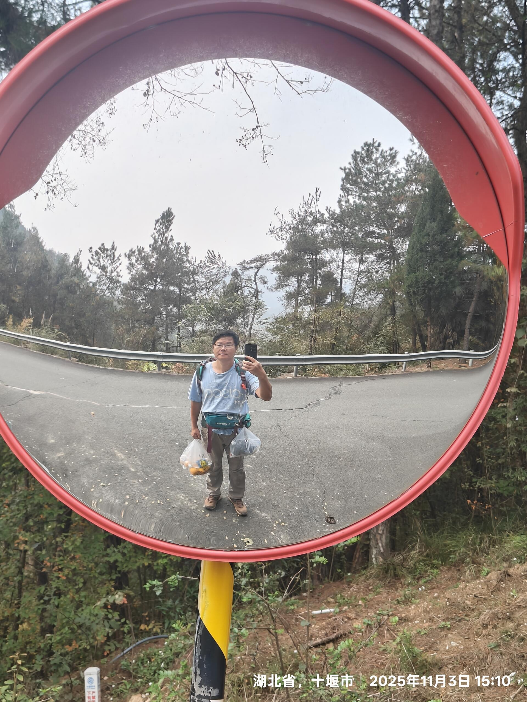 
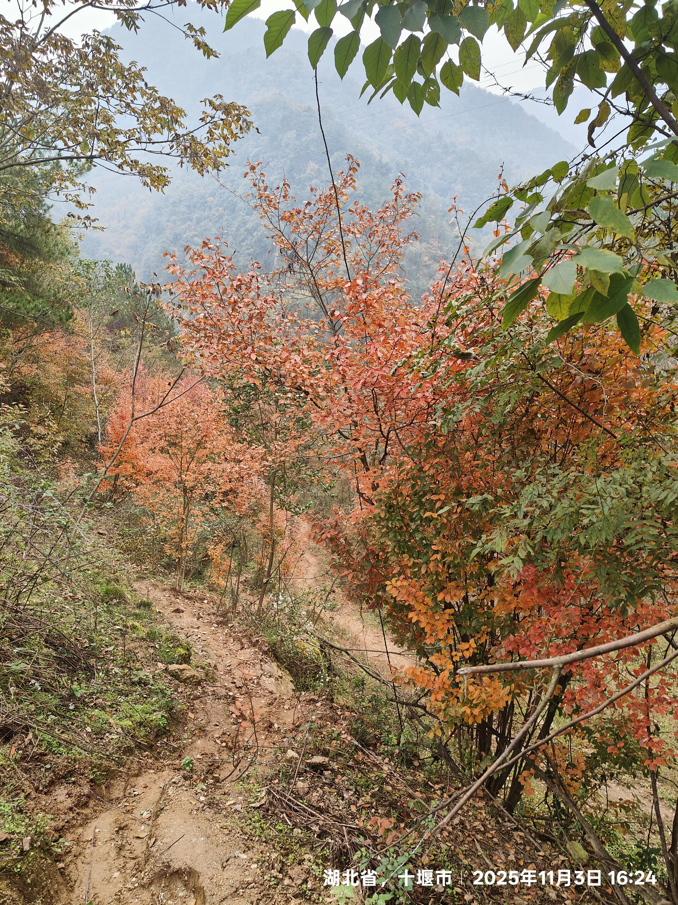 
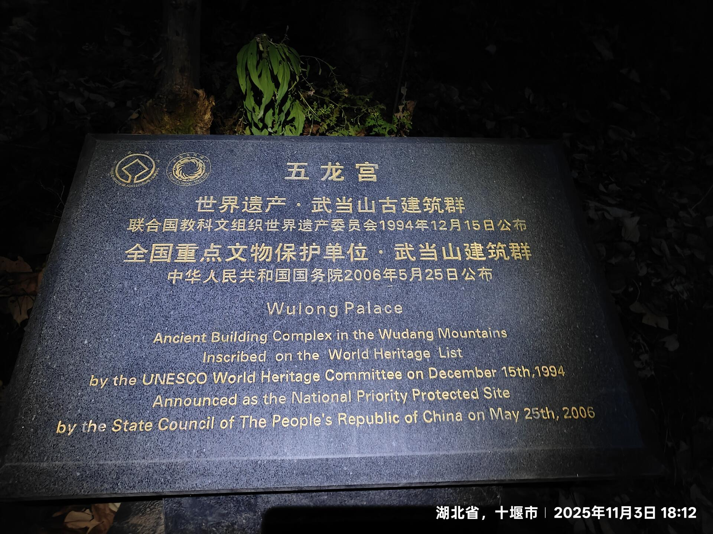 
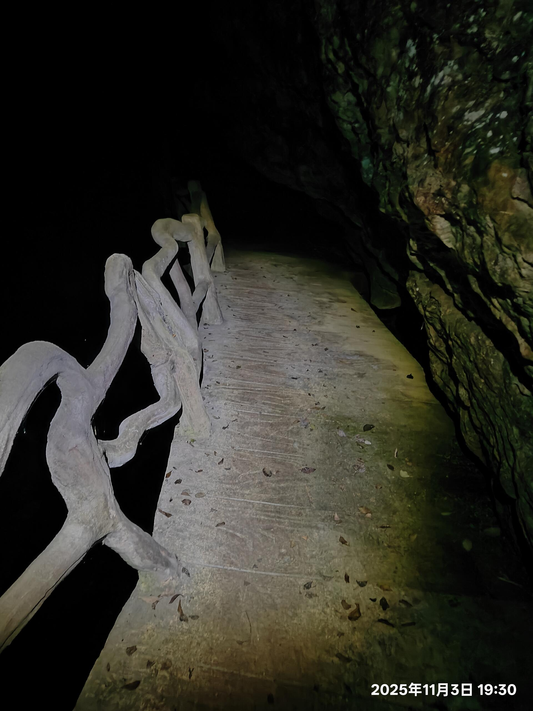 
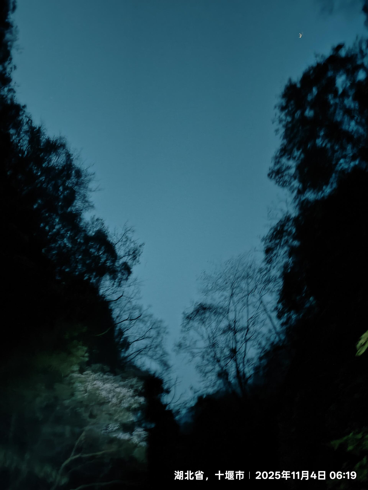 
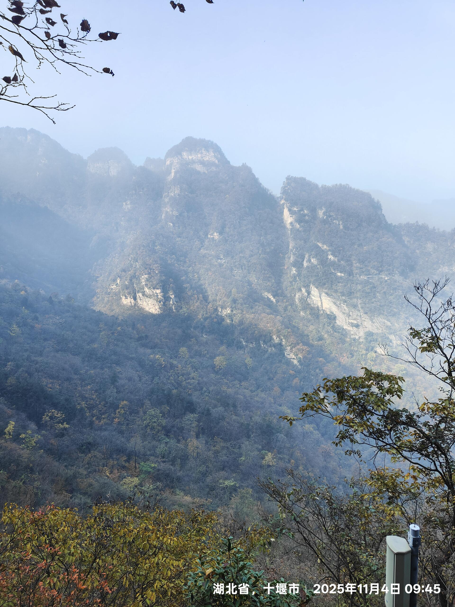 
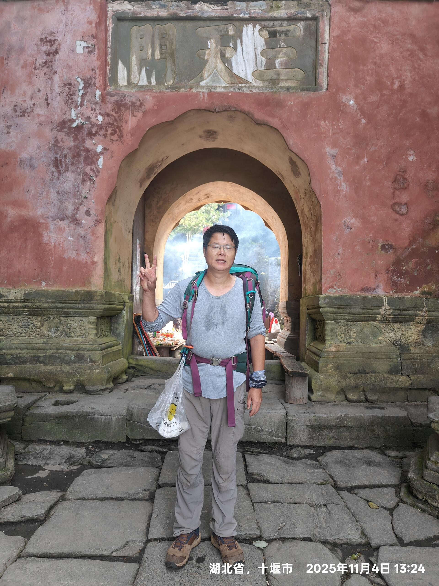 
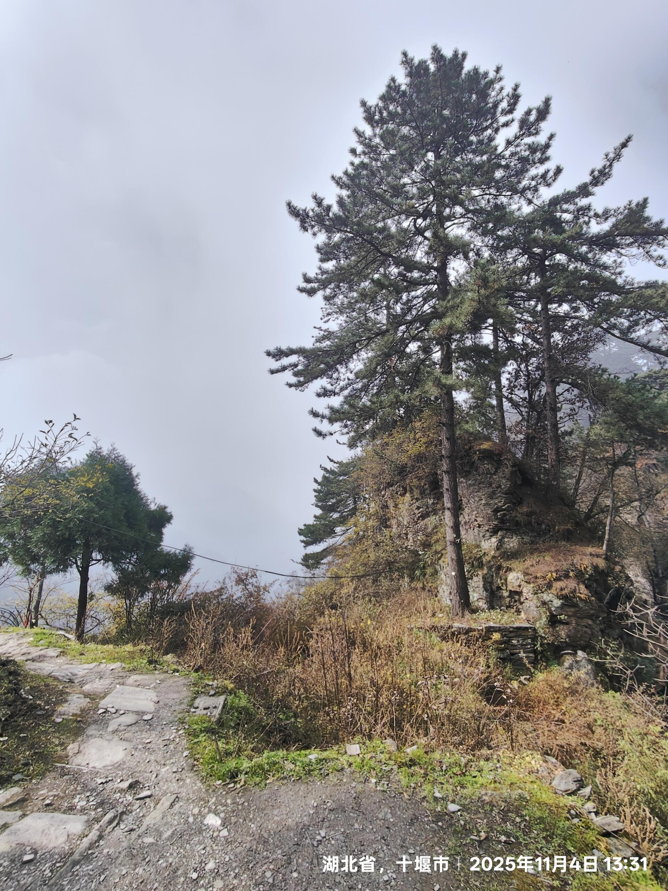 
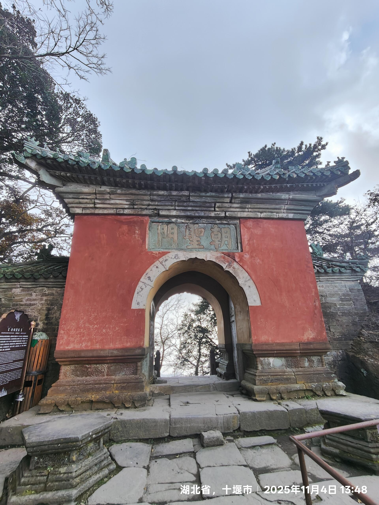 
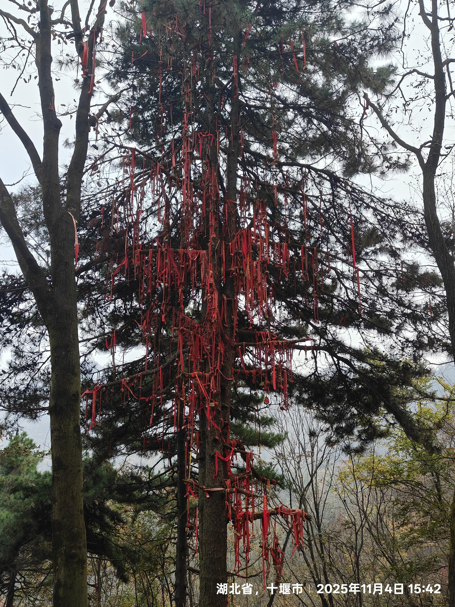 
