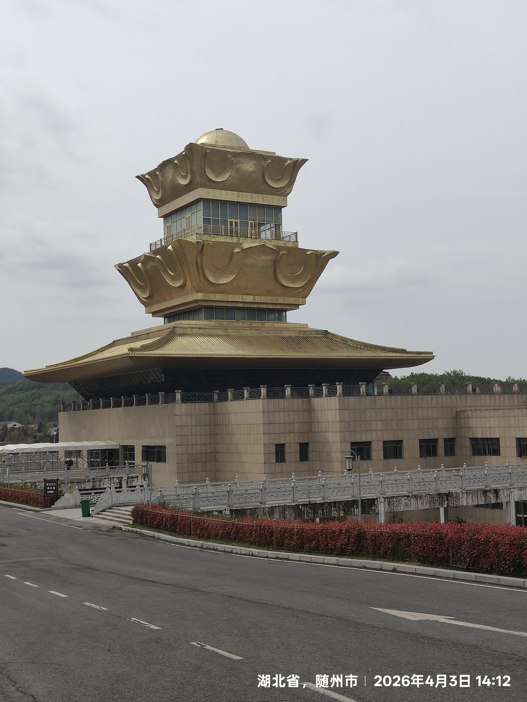
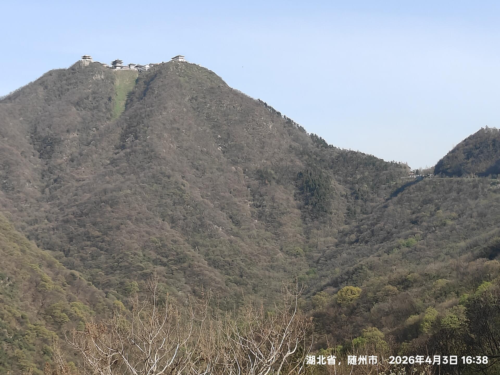
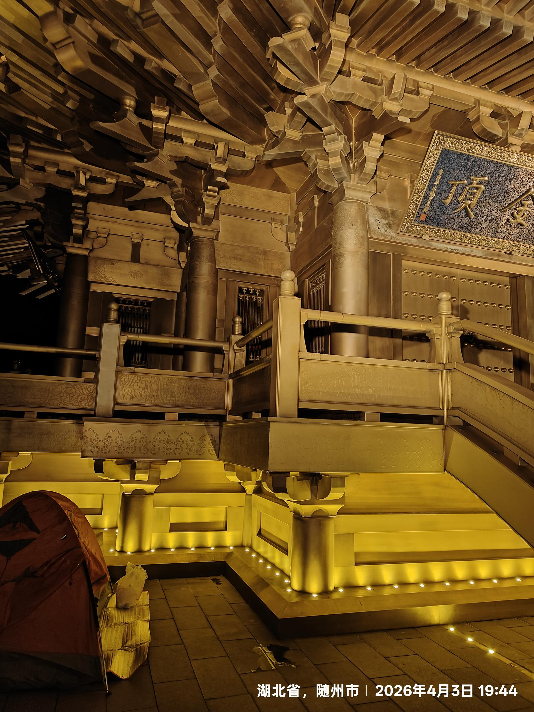
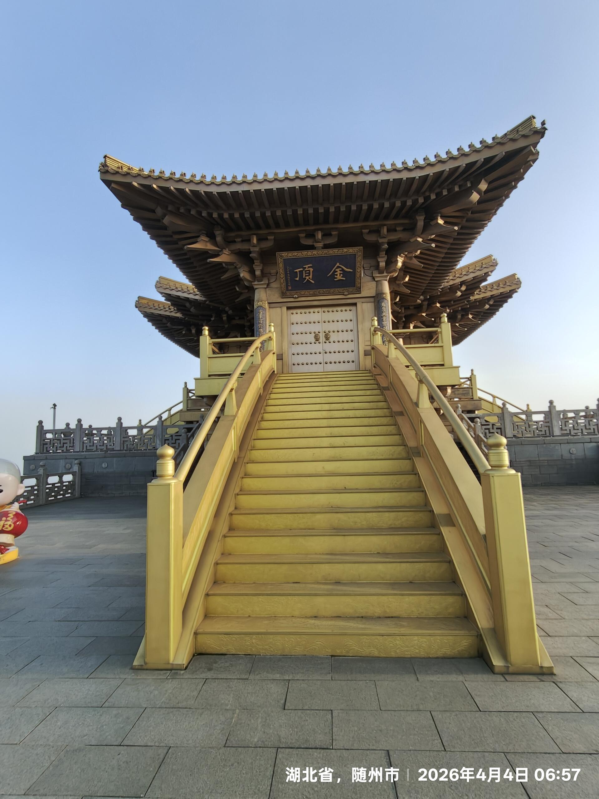
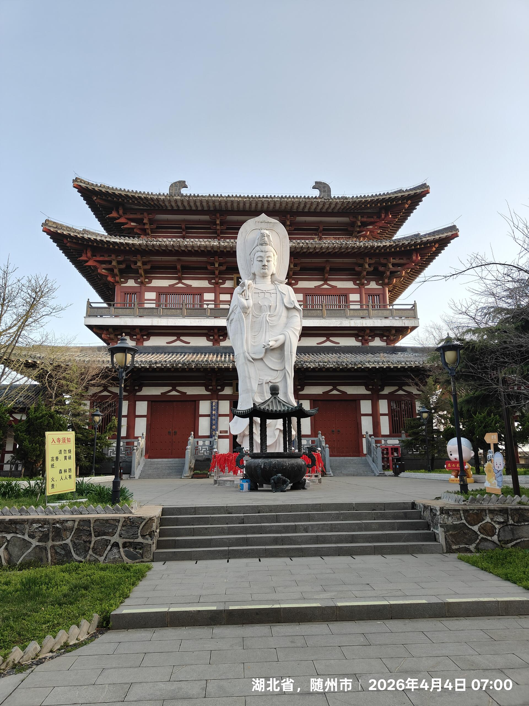
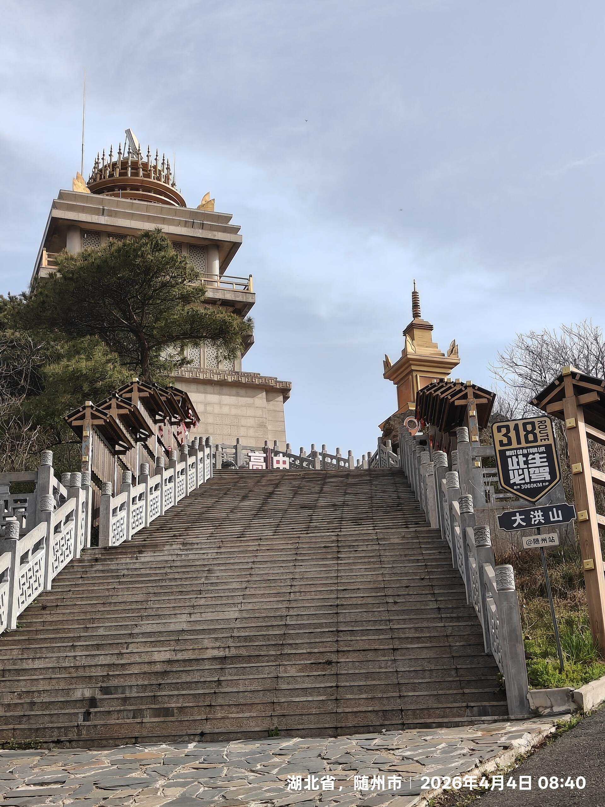
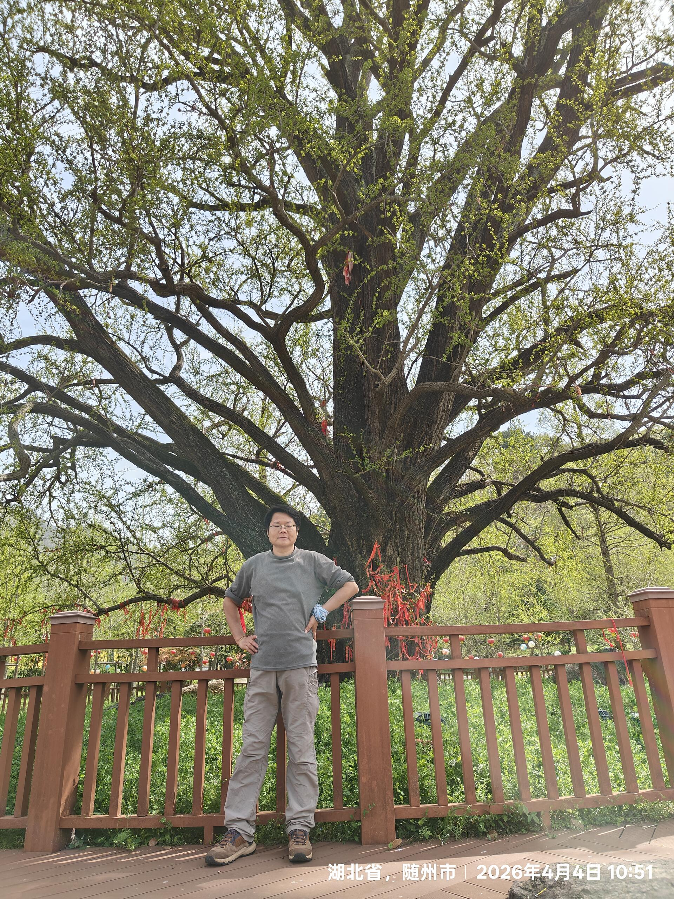
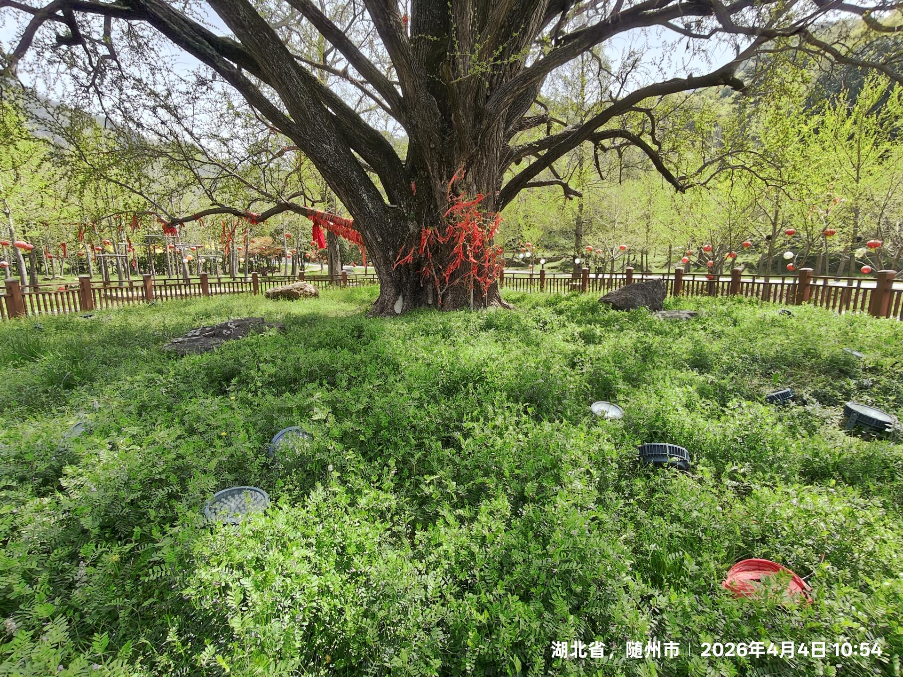
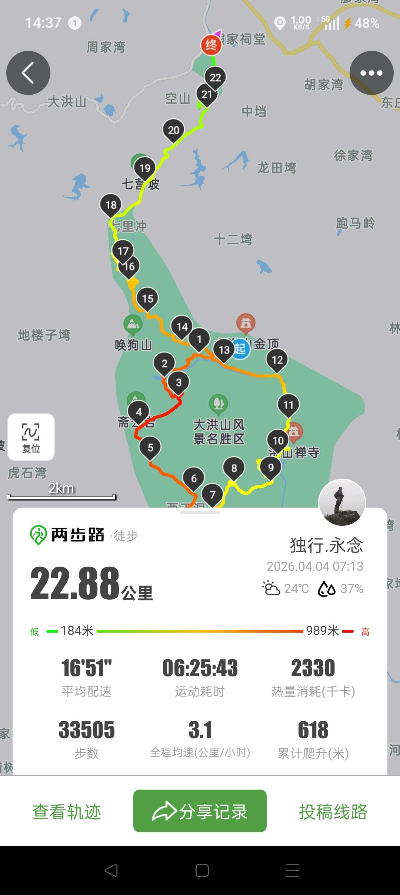

2026.4.3-4.4随州大洪山37公里爬山

清明回家，顺道爬随州大洪山

# 爬山行程
去程：上山14公里纯缓上坡，平路不足500米，重装34斤爬升爬得小腿肌肉拉伤。
返程：从景区门票口到灵官垭，继续向前，在分岔路口左转，到宝珠峰金顶扎帐篷露营，早起沿祈福古道下山回到灵官垭，去白龙天池，到状元台，路过樱花长廊，至两王洞（要门票没进去），沿绿林古道至废弃的筱泉洞，至核心景区千年古银杏。然后沿樵河古道返回灵官垭，保安给我优惠说45元让我上车坐车下山。我觉得不划算区区9公里纯下山路，我1.5小时就走到了，果断走路下山。

# 消费
别人最低消费400多住宿门票观光车，我零消费，体能就是省钱王道。

# 体验
随州大洪山适宜于重装挑战来训练体能，因为道路好走，安全，坡度不是很大。

___
 
 
 
 
 
 
 
 
 
