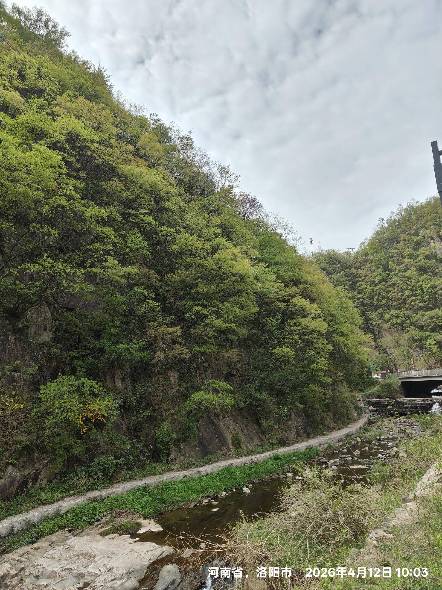
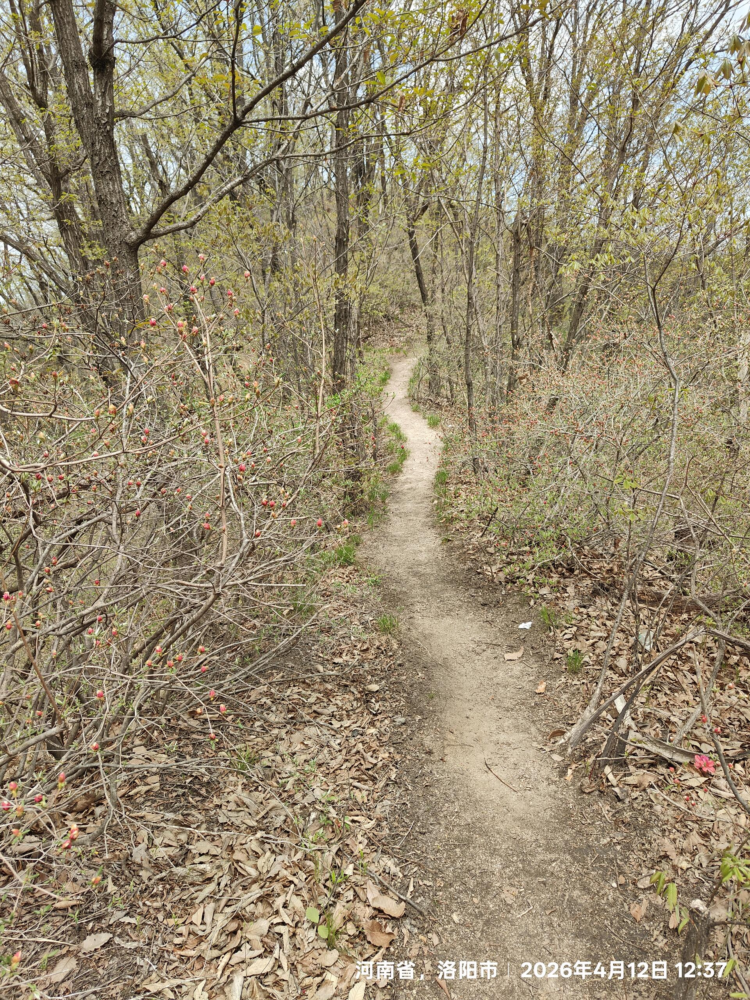
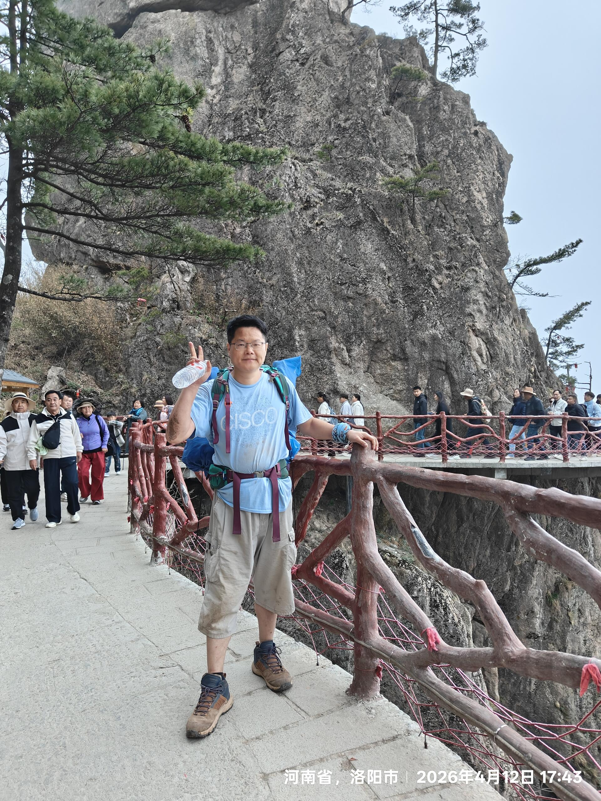
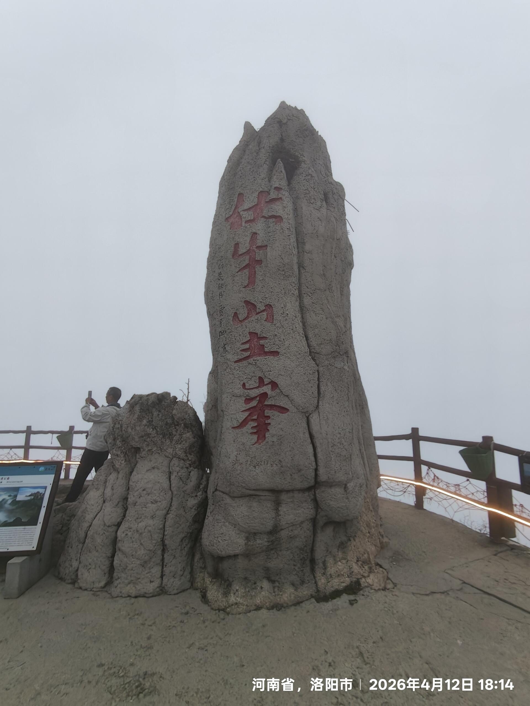
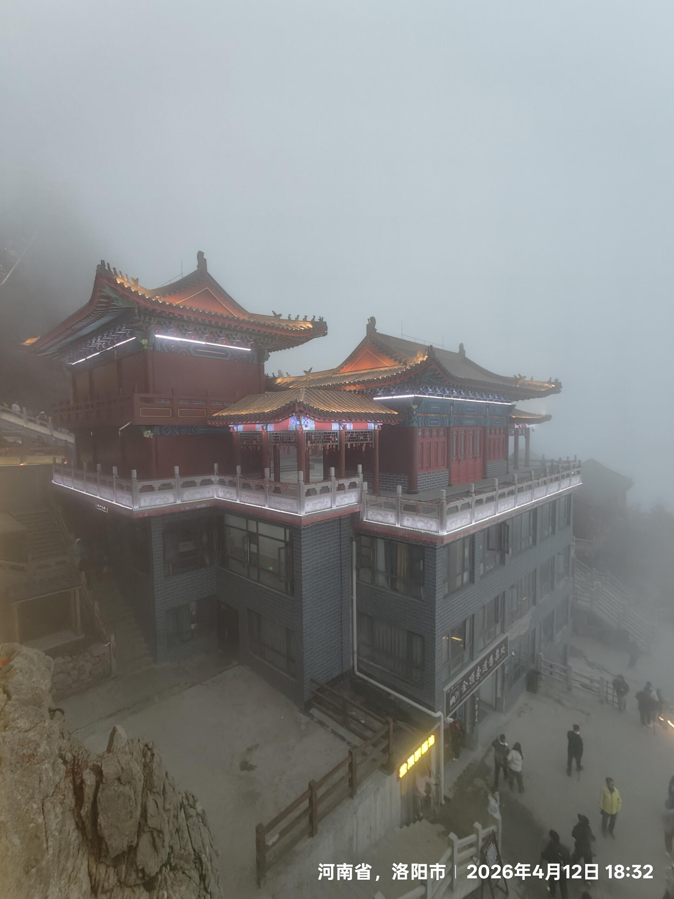
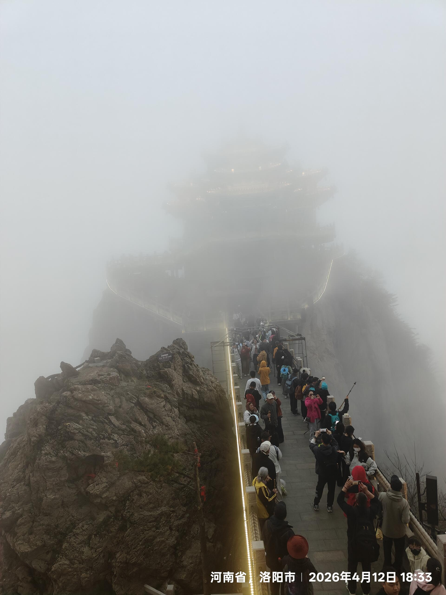
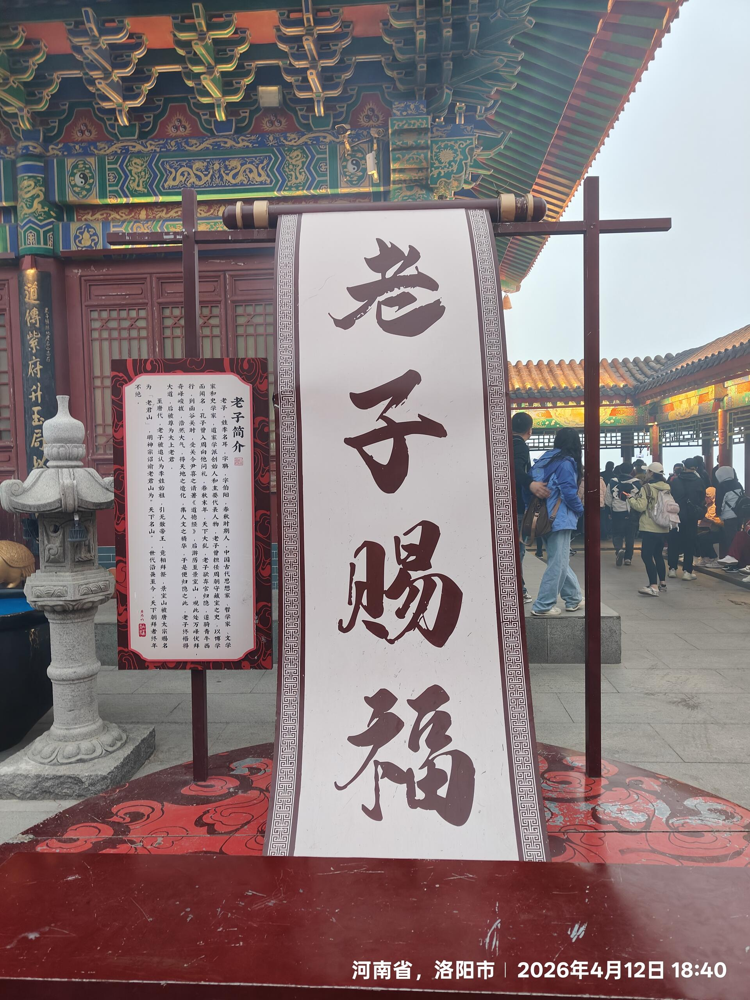
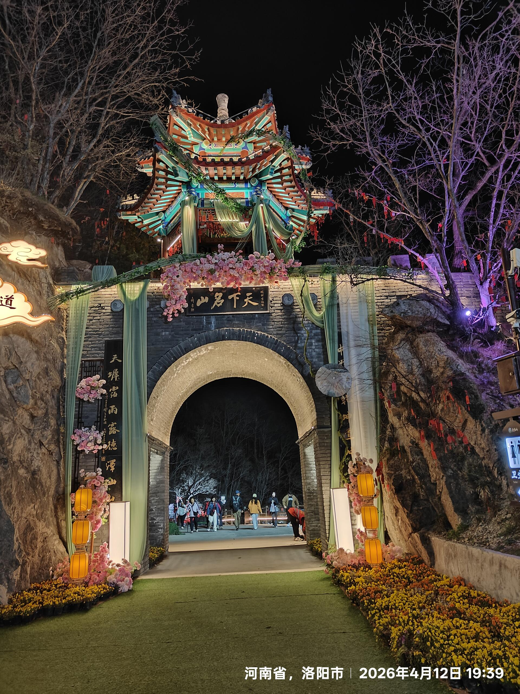
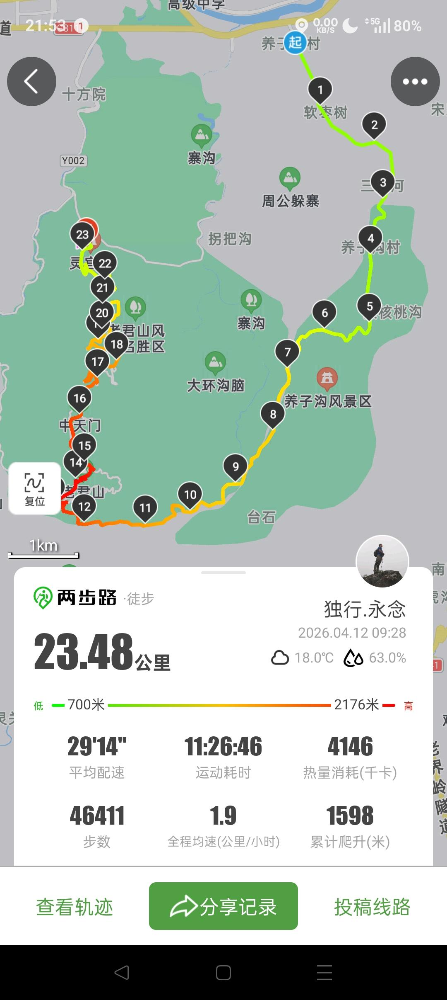

2026.4.12日重装36斤反向野穿老君山。

# 爬山行程
- ​前哨：第一天坐大巴从洛阳到养子沟住宿
- ​启动：第二天早晨从民宿出发，从养子沟路口走到栾川宽居农家院野穿山脚下，开始一路爬升。  
​生死边缘的几百米：走了9公里后，不小心偏离了轨迹，误入了一段由户外俱乐部飘带指引的山路。这是一段极陡极滑的上坡，靠膝盖跪地，抓树根树杆，抓旁边的野生灌木细枝，才好不容易爬上去，幸亏身高胳膊长，个头矮一点的都够不着没法抓。上山后又紧遇下山，这个更滑更难，我一路连抓带爬，经历了屁股着地，肚皮着地才险险下去。其中一段手抓一个树桩利用身高优势身体向下探，后来手抓不住了脚也踩不住了，只好肚皮着地胸脯贴地全身趴在地上向下滑，幸好滑行距离不长，但滑了区区三十公分左右，也有一种生死由天的感觉。这一段上坡一段下坡，体能稍差一点就会出事故，主要是路滑没有任何人工防护设施，今天幸好没下雨，否则后果不堪设想，曾经一度想解下登山杖辅助。上坡下坡过程中，除了屁股着地，肚皮着地地段外，全程都是紧抱着随机分散的树不敢松手，从一个树切换到另外一个树。 

总结：完全没有歇气，近2个小时只走了几百米远。路上一共遇到3个驴友，都是觉得相当地虐，我徒步15年，第一次竟然有了想叫救援的想法（如果再遇到那种极滑极陡的山），另外三个都有类似的想法。只有我和另外一个年轻人在天黑前赶到了景区道路，另外两个天黑爬山是相当的危险。  
早上9：30养子沟出发，下午18：30才到达景区道路，线路是相当的虐。  
全程23.48公里，耗时11个半小时。

# 体验
- 老君山山顶雾气极大，什么景色都看不见，山下23度，山顶我估计只有8度左右，因为我感觉稍冷（正常情况下我10度左右短裤短袖不会觉得冷）。
- 简单地转了几个景点天就黑了，然后再徒步10公里下山直到灵官殿出口，然后扎帐篷露营。
- 老君山没有旅游淡季，任何时候山上都是人挤人，人挨人，就如同十一五一的高速公路，永远等不到人少清净的时候。

# 个人建议：
- 不要轻易反穿这条线路，因为有座山路太滑。如果反穿，建议带冰爪，(这趟线路让我决定购买冰爪)，启用登山杖。
- 在洛阳火车站，不要轻信私人大巴拉客者的承诺，应该直接找城际汽车站的正规大巴(很容易找的)
- 山上没有适合的露营地点，到处人挤人，并且有风。下山后，或者下山半山腰扎营可行。

___
 
 
 
 
 
 
 
 
 
 
